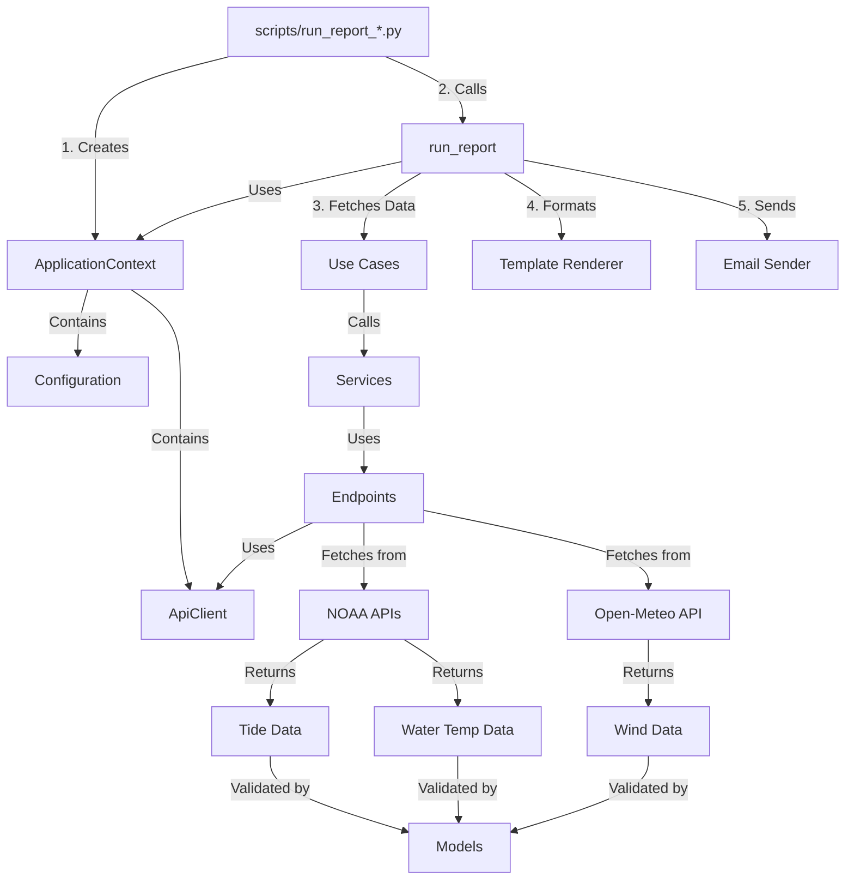
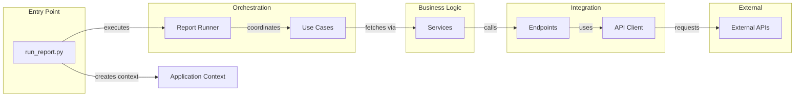
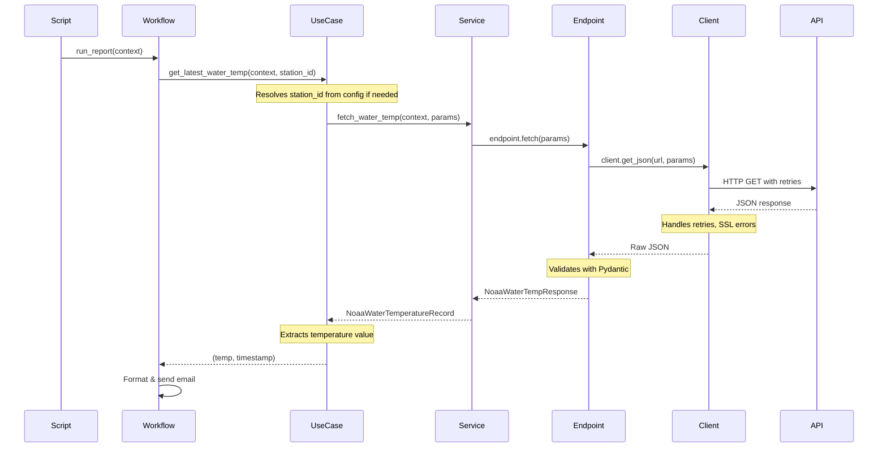

# Ocean Report Architecture

**Version:** 2.0  
**Last Updated:** 2026-06-16

---

## Table of Contents

1. [Overview](#overview)
2. [What This Application Does](#what-this-application-does)
3. [Architecture Principles](#architecture-principles)
4. [System Architecture](#system-architecture)
5. [Component Overview](#component-overview)
6. [Data Flow](#data-flow)
7. [Key Design Patterns](#key-design-patterns)
8. [Quick Start Guide](#quick-start-guide)
9. [Component Documentation](#component-documentation)

---

## Overview

Ocean Report is a **daily coastal conditions email system** that fetches data from multiple weather APIs and delivers formatted reports to subscribers. The application is built with a clean, layered architecture that separates concerns and makes it easy to understand, test, and extend.

### What Makes This Architecture Special

- **Clean Separation of Concerns**: Each layer has a single, well-defined responsibility
- **Type-Safe**: Uses Pydantic models throughout for validation and type safety
- **Testable**: Clear boundaries make unit and integration testing straightforward
- **Configurable**: Environment-based configuration with sensible defaults
- **Production-Ready**: Includes retry logic, SSL handling, logging, and error handling

---

## What This Application Does

**For Non-Technical Readers:**

Imagine you want a daily email telling you the weather conditions at the beach—water temperature, tide times, and wind forecasts. Ocean Report does exactly that:

1. **Gathers Information**: Connects to government weather services (NOAA) and weather APIs (Open-Meteo) to get the latest data
2. **Formats the Data**: Takes technical API responses and converts them into easy-to-read text
3. **Sends Emails**: Delivers a nicely formatted daily report to your inbox

**For Technical Readers:**

Ocean Report is a Python application that:
- Orchestrates data fetching from three external APIs (NOAA Tides, NOAA Water Temperature, Open-Meteo Wind)
- Transforms API responses into validated Pydantic models
- Formats data into human-readable email content
- Delivers reports via SMTP with configurable recipients

---

## Architecture Principles

### 1. **Layered Architecture**

The application follows a strict layering pattern from bottom to top:

```
┌─────────────────────────────────────┐
│         Workflows Layer             │  ← High-level orchestration
├─────────────────────────────────────┤
│         Use Cases Layer             │  ← Business logic coordination
├─────────────────────────────────────┤
│         Services Layer              │  ← Data fetching & transformation
├─────────────────────────────────────┤
│         Endpoints Layer             │  ← API-specific implementations
├─────────────────────────────────────┤
│         Models Layer                │  ← Data schemas & validation
├─────────────────────────────────────┤
│         API Client Layer            │  ← HTTP transport (retries, SSL, etc.)
├─────────────────────────────────────┤
│    Config + Application Context     │  ← Configuration & dependency injection
└─────────────────────────────────────┘
```

**Key Rule**: Higher layers can depend on lower layers, but **never the reverse**.

### 2. **Single Responsibility Principle**

Each component has **one job**:
- **API Client**: Only handles HTTP transport (timeouts, retries, SSL)
- **Endpoints**: Only know how to call specific APIs
- **Services**: Only fetch and return data
- **Use Cases**: Only coordinate business workflows
- **Models**: Only define data structures

### 3. **Dependency Injection**

The `ApplicationContext` carries configuration and the API client through the system. This makes testing easier and keeps components loosely coupled.

### 4. **Type Safety First**

Every API response is validated through Pydantic models. If the data doesn't match the schema, the application fails fast with clear error messages.

---

## System Architecture

### High-Level View



### Component Interaction



---

## Component Overview

### Core Components

| Component | Purpose | Key Files |
|-----------|---------|-----------|
| **[API Client](./api_client.md)** | Reusable HTTP client with retry logic, SSL handling, and timeouts | `api_client/client.py` |
| **[Application](./application.md)** | Dependency injection container holding config and API client | `application/context.py`, `application/factory.py` |
| **[Config](./config.md)** | Configuration loading with environment variable substitution | `config/loader.py`, `config/schemas.py` |
| **[Endpoints](./endpoints.md)** | API-specific implementations for NOAA and Open-Meteo | `endpoints/noaa/*`, `endpoints/openmeteo/*` |
| **[Models](./models.md)** | Type-safe data schemas using Pydantic | `models/noaa/*`, `models/openmeteo/*` |
| **[Services](./services.md)** | Pure data fetching functions (no business logic) | `services/*.py` |
| **[Use Cases](./use_cases.md)** | Business logic orchestration with default resolution | `use_cases/*.py` |
| **[Workflows](./workflows.md)** | Top-level report generation workflow | `workflows/report_runner.py` |
| **[Emailer](./emailer.md)** | Email template rendering and SMTP delivery | `emailer/template_renderer.py`, `emailer/sender.py`, `emailer/template_helpers.py` |
| **[Utils](./utils.md)** | Date utilities and wind calculations | `utils/*.py` |
| **[Logger](./logger.md)** | Centralized logging configuration | `logger.py` |

---

## Data Flow

### Complete Request Flow (Detailed)

Let's trace a single water temperature request through the entire system:

```
1. Entry Point (scripts/run_report.py)
   └─> Creates ApplicationContext
       └─> Loads config from config.yaml
       └─> Creates ApiClient with retry/SSL settings

2. Workflow Layer (workflows/report_runner.py)
   └─> run_report() orchestrates the entire process
   └─> Calls use case: get_latest_water_temp()

3. Use Case Layer (use_cases/water_temperature.py)
   └─> Resolves defaults (station_id from config)
   └─> Builds NoaaWaterTempParams
   └─> Calls service: fetch_water_temp()

4. Service Layer (services/water_temp_service.py)
   └─> Creates WaterTemperatureEndpoint
   └─> Calls endpoint.fetch(params)

5. Endpoint Layer (endpoints/noaa/water_temperature.py)
   └─> Builds full URL with parameters
   └─> Calls client.get_json(url, params)

6. API Client Layer (api_client/client.py)
   └─> Makes HTTP request with retries
   └─> Handles SSL errors, timeouts
   └─> Returns raw JSON

7. Response Flows Back Up
   ├─> Endpoint validates JSON → NoaaWaterTempResponse model
   ├─> Service returns validated record
   ├─> Use case extracts temperature value
   └─> Workflow formats and adds to email

8. Email Delivery
   └─> Template renderer generates email body from Jinja2 template
   └─> Sender delivers via SMTP
```

### Visual Data Flow



---

## Key Design Patterns

### 1. Factory Pattern (Application Context)

**Problem**: Components need configuration and an API client, but we don't want to pass them separately everywhere.

**Solution**: `ApplicationContext` bundles them together. The factory creates contexts from different sources:

```python
# Default config (production)
context = create_application_context()

# Custom config file
context = create_application_context(config_path="custom.yaml")

# Pre-loaded config
config = load_app_config("test.yaml")
context = create_application_context(config=config)
```

### 2. Dependency Injection

**Problem**: Components shouldn't create their own dependencies (hard to test).

**Solution**: Pass dependencies in explicitly:

```python
# Service receives context with client inside
def fetch_water_temp(context: ApplicationContext, params: NoaaWaterTempParams):
    endpoint = WaterTemperatureEndpoint(context.client)
    return endpoint.fetch(params)
```

### 3. Layer Separation (Clean Architecture)

**Problem**: Mixing business logic with API calls makes code hard to understand and test.

**Solution**: Strict layers with clear responsibilities:

- **Use Cases** = "What should happen?" (orchestration)
- **Services** = "How do we get data?" (integration)
- **Endpoints** = "How do we call this specific API?" (implementation)
- **Client** = "How do we make HTTP requests?" (infrastructure)

### 4. Type-Safe Models (Schema Validation)

**Problem**: API responses can be unpredictable; runtime errors are hard to debug.

**Solution**: Pydantic models validate everything:

```python
class NoaaWaterTemperatureRecord(BaseModel):
    timestamp: str = Field(alias="t")
    temperature: float = Field(alias="v")
    
# If API returns bad data, Pydantic raises ValidationError immediately
```

---

## Quick Start Guide

### For Developers Adding New Features

1. **Adding a New Data Source**:
   - Create model in `models/provider_name/`
   - Create endpoint in `endpoints/provider_name/`
   - Create service in `services/`
   - Create use case in `use_cases/`
   - Update workflow in `workflows/report_runner.py`

2. **Adding a New Configuration Option**:
   - Update schema in `config/schemas.py`
   - Update `config.yaml`
   - Access via `context.config.your_new_setting`

3. **Changing API Behavior**:
   - Timeouts/retries: Modify `api_client/client.py`
   - API-specific logic: Modify `endpoints/`
   - Business logic: Modify `use_cases/`

### For DevOps/Operations

- **Configuration**: Set `OCEAN_REPORT_CONFIG` environment variable
- **Logging**: Configure in `config.yaml` under `logging:` section
- **Secrets**: Use environment variables (EMAIL_PASSWORD, etc.)
- **Monitoring**: Check logs in `logs/runs/` for execution details

---

## Component Documentation

Detailed documentation for each component:

- **[API Client](./api_client.md)** - HTTP transport layer with retry logic
- **[Application](./application.md)** - Dependency injection and context management
- **[Config](./config.md)** - Configuration loading and validation
- **[Emailer](./emailer.md)** - Email formatting and SMTP delivery
- **[Endpoints](./endpoints.md)** - API-specific endpoint implementations
- **[Logger](./logger.md)** - Centralized logging configuration
- **[Models](./models.md)** - Type-safe data schemas
- **[Services](./services.md)** - Data fetching service layer
- **[Use Cases](./use_cases.md)** - Business logic orchestration
- **[Utils](./utils.md)** - Shared utility functions
- **[Workflows](./workflows.md)** - Report generation workflow

---

## Common Questions

### Why so many layers?

Each layer has a specific job. This makes the code:
- **Easier to test**: You can test business logic without making real API calls
- **Easier to change**: Want to swap NOAA for a different API? Just change the endpoint
- **Easier to understand**: When you read use_cases/, you see *what* happens, not *how*

### Why Pydantic models?

Type safety catches bugs early. If NOAA changes their API format, you'll know immediately instead of getting mysterious errors in production.

### Why ApplicationContext?

Without it, you'd need to pass `config` and `client` separately to every function. ApplicationContext bundles them, making function signatures cleaner.

### How do I debug issues?

1. Check logs in `logs/runs/`
2. Look at the layer where the error occurs
3. Use the layer diagram above to understand the flow
4. Each layer has clear inputs/outputs, making debugging straightforward

---

## Evolution Notes

This is **Architecture v2.0**. The major improvements over v1:

- ✅ Separated API client from business logic
- ✅ Introduced proper layering (use cases, services, endpoints)
- ✅ Added type-safe models with Pydantic
- ✅ Centralized configuration management
- ✅ Improved testability with dependency injection
- ✅ Better error handling and retry logic

See [architecture_v1.md](./architecture_v1.md) for the original design and [architecture_v2.md](./architecture_v2.md) for migration notes.

---

**Next Steps**: Read the component-specific documentation linked above to understand each piece in detail.
