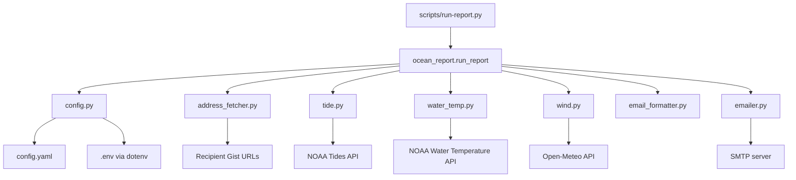

# Ocean Report Package Architecture

## Overview

`ocean_report` is a small orchestration package that builds a daily coastal conditions email from three external data sources:

- NOAA tide predictions
- NOAA water temperature observations
- Open-Meteo wind forecasts

The package is organized around a single application workflow in `ocean_report.main.run_report()`. Most modules are narrow adapters or pure formatting helpers that support that workflow.

At runtime, the package does four things:

1. Load configuration and recipient settings.
2. Fetch tide, water temperature, and wind data.
3. Format those results into a plain-text email body.
4. Send the email through SMTP or print it for local/testing use.

## Entry Points

### Package entry

The public package surface is defined in `src/ocean_report/__init__.py`.

- `run_report()` is the primary application entry point.
- `hello()` is a lightweight installation check used by the script wrapper.

### Script entry

`scripts/run-report.py` is the main executable wrapper for local runs.

- Reads `RUN_EMAIL` and `TEST` from the environment.
- Calls `ocean_report.hello()` as a smoke check.
- Delegates execution to `ocean_report.run_report()`.

## High-Level Structure



## Component Responsibilities

### Orchestration

`src/ocean_report/main.py`

- Owns the end-to-end application flow.
- Resolves sender, password, recipients, and station/location settings from shared config.
- Chooses whether to fetch BCC recipients from a remote Gist or from config.
- Calls each data adapter in sequence.
- Hands formatted sections to the email formatter.
- Sends the email or prints a preview, depending on `run_email`.

This module is the architectural center of the package. Other modules mostly expose focused functions that it coordinates.

### Configuration and runtime settings

`src/ocean_report/constants.py`

- Locates the project root using `find_dotenv("pyproject.toml")`.
- Defines the absolute path to `config.yaml`.

`src/ocean_report/utils.py`

- Loads YAML configuration with `${VAR}` substitution from environment variables.
- Provides `safe_get()`, an HTTP helper that retries with `verify=False` after SSL verification failures.
- Contains date helpers used for seasonal recipient selection.

`src/ocean_report/config.py`

- Loads `.env` at import time.
- Loads `config.yaml` at import time through `load_config_with_env_substitution()`.
- Exposes module-level constants derived from config, including:
  - NOAA station and buoy IDs
  - latitude and longitude
  - beach orientation
  - recipient Gist URLs
  - summer date offsets

This is effectively the package's shared runtime state. Multiple modules import values from here directly.

### Recipient selection

`src/ocean_report/address_fetcher.py`

- Determines whether the app is in summer or offseason using `determine_is_summer()`.
- Chooses among main, offseason, or test recipient Gist URLs.
- Fetches raw recipient text from a public URL.
- Normalizes the recipient list into a lowercase comma-separated string.

This module is the only part of the package that contains season-aware audience routing logic.

### External data adapters

`src/ocean_report/tide.py`

- Calls NOAA's tide predictions endpoint.
- Returns raw prediction dictionaries.
- Filters tide events to daytime hours before formatting.

`src/ocean_report/water_temp.py`

- Calls NOAA's water temperature endpoint.
- Returns the latest value as a float or `None`.

`src/ocean_report/wind.py`

- Calls Open-Meteo hourly forecast data.
- Filters results to a fixed set of report times.
- Converts speed from km/h to mph.
- Maps direction degrees to 16-point compass labels.
- Classifies wind relative to beach orientation.

Together, these modules form the package's integration layer. They translate third-party API responses into the internal structures consumed by the formatter.

### Presentation and delivery

`src/ocean_report/email_formatter.py`

- Formats each domain result into human-readable plain text.
- Builds the final email body from ordered sections.
- Contains an unused HTML formatter for wind forecasts.

`src/ocean_report/emailer.py`

- Creates an SMTP message.
- Sends it using the configured SMTP server and port.
- Supports a primary `To` recipient plus a BCC recipient list.

### Logging

`src/ocean_report/logger.py`

- Configures a module-scoped logger with `INFO` level.
- Avoids duplicate handler registration.

Logging is used across the adapters and orchestrator for progress and error reporting.

## Runtime Flow

The main execution path in `run_report()` is strictly sequential.

1. Initialize logging and print the current date.
2. Load environment variables through `load_dotenv()`.
3. Read email settings from the shared config object.
4. Resolve BCC recipients:
   - If `USE_RECIP_URL` is `True`, call `address_fetcher.get_recipients()`.
   - Otherwise, use configured recipients directly.
5. Read the NOAA station ID from config.
6. Fetch and process tide data:
   - `fetch_tide_data()`
   - `filter_daytime_tides()`
   - `format_tide_for_email()`
7. Fetch and format water temperature:
   - `fetch_water_temp()`
   - `format_water_temp()`
8. Fetch and format wind forecast:
   - `get_daily_wind_data()`
   - `format_wind_forecast_email()`
9. Build the email body with `generate_email_body()`.
10. Build the subject line, optionally prefixed with `TEST:`.
11. Either send the email via SMTP or print a local preview.

This design is simple and easy to follow. It also means failures in one upstream integration can directly affect the daily report unless the adapter returns a safe fallback value.

## Internal Data Contracts

The package relies on a few lightweight, informal data contracts instead of explicit classes or schemas.

### Tide events

Tide data is passed around as a list of dictionaries shaped like:

```python
{"t": "2024-07-01 07:00", "v": "0.5", "type": "L"}
```

### Wind forecast entries

Wind data is normalized into dictionaries shaped like:

```python
{
    "time": "8 AM",
    "speed_kmh": 10.0,
    "direction_deg": 90,
    "speed_mph": 6.2,
    "direction": "E",
    "wind_type": "Cross-shore",
}
```

### Email body sections

`generate_email_body()` accepts a list of already-formatted strings, such as:

```python
[
    "🌡️ Water Temperature: 72.5 °F\n\n",
    "🌊 Tides:\nHigh Tide at 7:32 AM — 3.1 ft\n\n",
    "🌬️ Wind Forecast:\n...",
]
```

These contracts are simple but implicit. There is no central schema enforcement between producers and consumers.

## Configuration Model

The package uses a hybrid configuration approach:

- `config.yaml` defines structure and defaults.
- environment variables provide deploy-time secrets and location-specific values.
- `config.py` converts that merged configuration into module-level constants.

Key configuration domains are:

- `noaa`: station and buoy identifiers
- `email`: SMTP settings, sender credentials, recipients, recipient URLs
- `location`: latitude, longitude, beach orientation
- `summer`: offsets that define the summer recipient window

### Important architectural characteristic

Configuration is loaded during module import, not application startup.

That has two practical effects:

- Import order matters when tests monkeypatch environment variables.
- Runtime configuration is shared globally across modules rather than passed explicitly.

For a package of this size, that tradeoff keeps the call sites simple. It also couples the code more tightly to process-wide state.

## External Integrations

### NOAA

Used for two independent data products:

- tide predictions in `tide.py`
- water temperature in `water_temp.py`

Both integrations return parsed JSON data and degrade by returning empty or missing values when requests fail.

### Open-Meteo

Used in `wind.py` for hourly wind forecast data. Only a fixed subset of times is included in the final report.

### Gist-hosted recipients

Used in `address_fetcher.py` to keep large or seasonally changing BCC lists outside the repository.

### SMTP

Used in `emailer.py` for final message delivery using STARTTLS and login credentials from configuration.

## Error Handling Strategy

The current package prefers lightweight recovery over strict failure propagation.

- `tide.py` returns an empty list on request errors.
- `water_temp.py` returns `None` on request or parsing errors.
- `email_formatter.py` formats missing water or wind data as `unavailable`.
- `wind.py` is stricter and raises `RuntimeError` when the upstream request fails.
- `address_fetcher.py` raises if the recipient URL is missing or cannot be retrieved.
- `emailer.py` raises if no password is provided.

This means the report is partially fault tolerant, but not uniformly so. Recipient lookup and wind fetch failures are more likely to stop the run than tide or temperature failures.

## Testing Coverage

The `tests/` directory reflects the current architectural seams.

- `test_config.py` checks environment substitution into YAML config.
- `test_email_formatter.py` checks formatted wind output.
- `test_gist_url.py` checks recipient parsing and seasonal URL selection.
- `test_noaa_data.py` checks NOAA adapters with mocks and one live NOAA water temperature call.
- `test_open_meto.py` checks wind forecast extraction from mocked hourly data.
- `test_wind.py` checks compass direction and beach-relative wind classification.

Most tests validate function-level behavior rather than the full `run_report()` orchestration path.

## Architectural Strengths

- Clear single workflow centered in `run_report()`.
- Narrow modules with mostly focused responsibilities.
- Good separation between data retrieval, formatting, and delivery.
- Simple configuration story that works for local runs and GitHub Actions.
- Lightweight tests around the core transformation logic.

## Current Constraints

- Configuration is global and import-time initialized.
- There are no explicit typed models for tide, wind, or email section data.
- The orchestration layer depends directly on concrete modules rather than abstractions.
- Error handling is inconsistent across integrations.
- `USE_RECIP_URL` is a module constant rather than a configurable runtime option.
- SMTP delivery and external HTTP integrations are not wrapped behind interfaces, which makes end-to-end testing narrower than it could be.

## Future Improvements

The current design is appropriate for a small automation package. If the project grows, the next improvements should focus on reducing implicit state, making failure behavior more predictable, and widening the testing surface without adding unnecessary framework complexity.

### 1. Move configuration to an explicit runtime object

Configuration is currently loaded at import time and exposed as module-level constants. A small `ReportSettings` object created at startup would make runtime behavior more explicit and would remove a large amount of hidden process-wide state.

That would improve:

- test isolation
- local debugging with alternate settings
- future support for CLI flags or notebook overrides

### 2. Introduce typed models for shared data

The tide, wind, and email-section payloads are passed between modules as informal dictionaries and strings. Replacing those implicit contracts with `dataclass` models would make adapter boundaries clearer and reduce formatting-time key errors.

Good candidates include:

- `TideEvent`
- `WindForecastEntry`
- `EmailSection`
- `RecipientSet`

### 3. Standardize integration failure handling

Adapters currently fail in different ways: some return empty values, others raise exceptions. A consistent policy would make the orchestration layer easier to reason about and easier to operate in GitHub Actions.

One practical direction is:

- adapters return normalized data or a structured failure result
- `run_report()` decides whether to continue with partial data or fail fast
- formatter functions stay focused on presentation rather than recovery policy

### 4. Separate report construction from delivery

`run_report()` currently assembles the report and sends it. Splitting those responsibilities would make the core workflow easier to test and easier to reuse from notebooks or future CLIs.

For example:

- `build_report()` could return subject, body, and recipient metadata
- `deliver_report()` could handle SMTP delivery
- local preview flows could call report construction without branching inside the same function

### 5. Replace hard-coded behavior flags with configuration

`USE_RECIP_URL` is currently a module constant in `main.py`. Converting that to configuration would make operational behavior explicit and avoid source edits for runtime changes.

Related configurable values could include:

- whether to use remote recipients
- which daily wind times to include
- whether partial reports are allowed when one provider fails

### 6. Add thin interfaces around external systems

The package does not need a heavy abstraction layer, but small injectable boundaries around NOAA, Open-Meteo, Gist fetching, and SMTP would improve testability and make future provider changes less disruptive.

Simple protocol-style interfaces or injected functions would be enough.

### 7. Add one orchestration-level test

Most current tests cover individual modules in isolation. One high-value orchestration test around `run_report()` or a future `build_report()` function would help catch breakage across module boundaries.

That test should mock:

- recipient resolution
- NOAA tide and temperature responses
- Open-Meteo wind responses
- SMTP delivery

The goal is not broad integration coverage. The goal is to verify that the package can still assemble a complete report when the dependencies return expected data.

### 8. Make operational modes more explicit in docs and config

The package already supports several runtime modes, but some of that behavior is implicit rather than documented as first-class operating modes.

Those modes include:

- normal recipient flow
- offseason recipient flow
- test-recipient flow
- send-email mode
- print-only mode

Making those modes explicit would reduce ambiguity for future maintenance and make the package easier to operate outside the original GitHub Actions path.

## Summary

Ocean Report is best understood as a configuration-driven daily reporting pipeline. The package is intentionally simple:

- `main.py` orchestrates
- `config.py` and `utils.py` provide shared runtime services
- adapter modules fetch external data
- formatter functions turn that data into report text
- `emailer.py` delivers the final message

That architecture is appropriate for a small automation package and is easy to maintain as long as the integration points remain stable.
